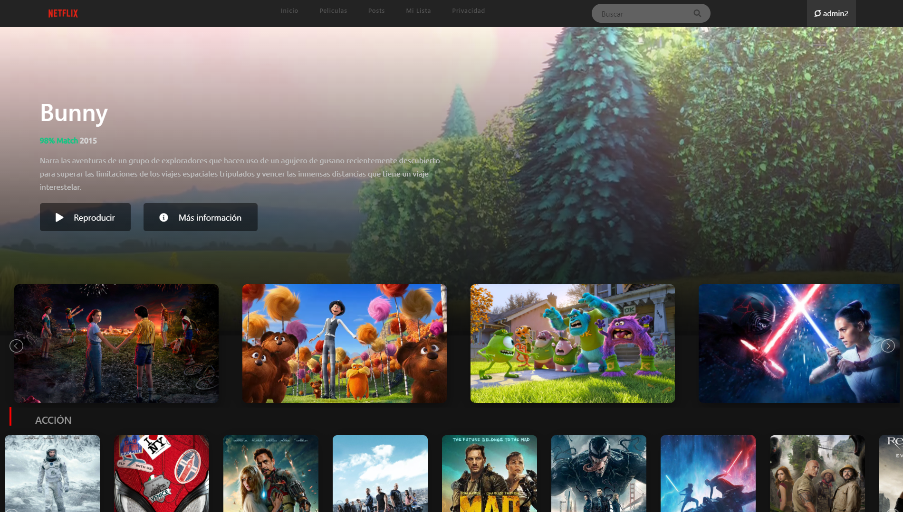
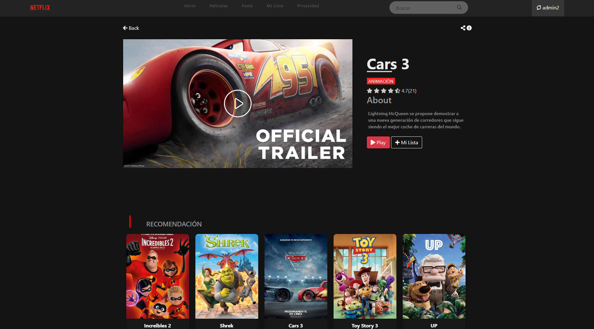
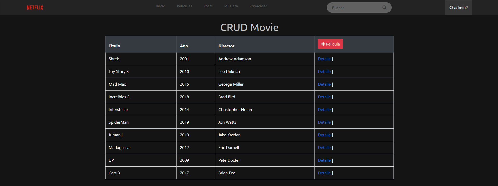
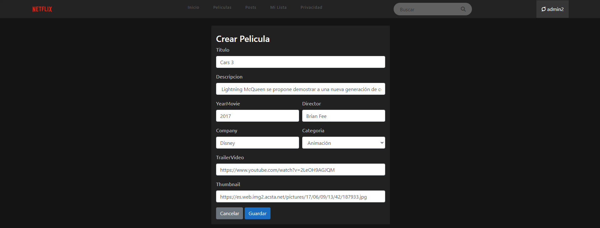
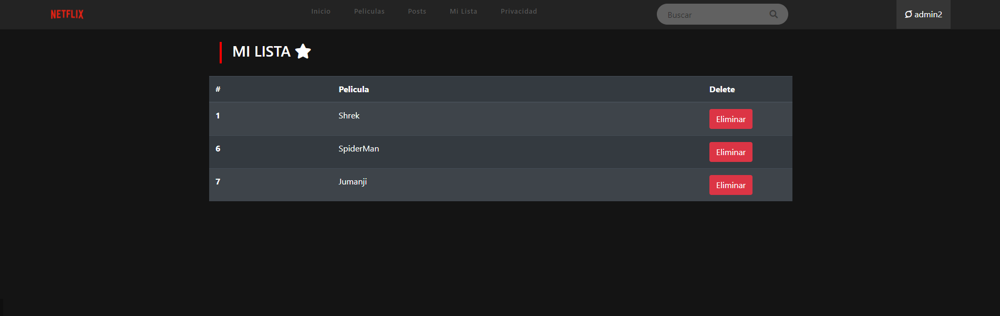
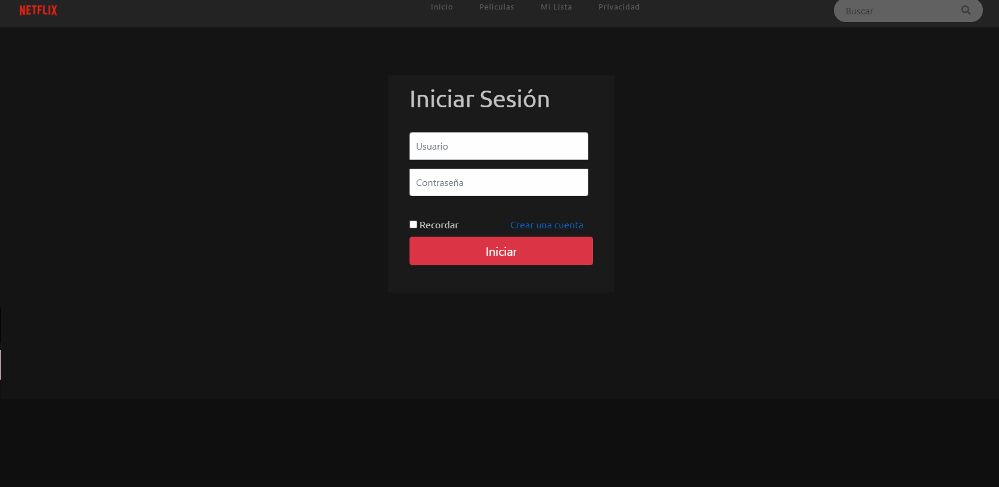
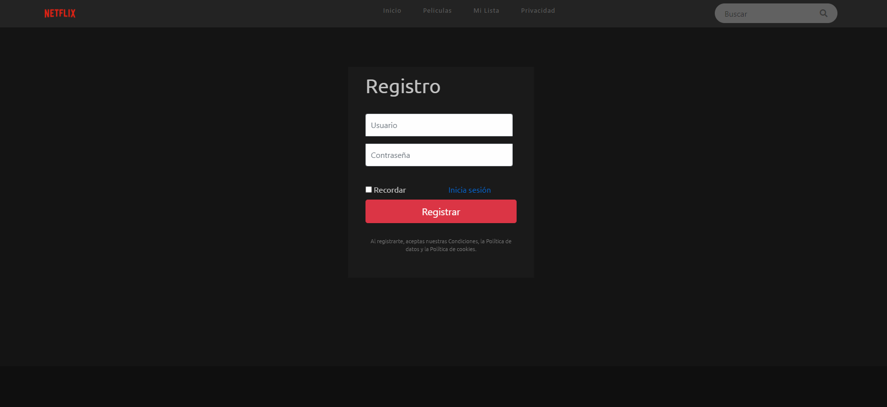
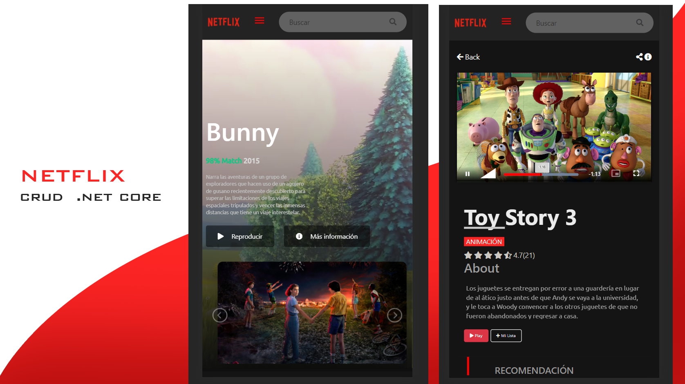

# Netflix-CRUD 🎬
Netflix CRUD ASP.NET Core MVC without Enitity Framework

	
	<h1>Netflix CRUD - .NET Core</h1>
	

		<b>Para la producción de este proyecto se utilizaron: .NET Core, JQuery, Bootstrap y SQL Server.</b>
	

	 

## Screenshots
<h3 align="center"><strong>Screen 01 - Pantalla de Inicio</strong></h3>

<h3 align="center"><strong>Screen 02 - Detalle película</strong></h3>

<h3 align="center"><strong>Screen 03 - Lista de pelicula creada</strong></h3>

<h3 align="center"><strong>Screen 04 - Crear o Editar Película</strong></h3>

<h3 align="center"><strong>Screen 05 - Favorito</strong></h3>

<h3 align="center"><strong>Screen 06 - Iniciar Sesión</strong></h3>

<h3 align="center"><strong>Screen 07 - Registro</strong></h3>

<h3 align="center"><strong>Screen 08 - Mobile version</strong></h3>

***

Con ❤️ por [JaksonCasas19](https://github.com/JaksonCasas19) 😊
